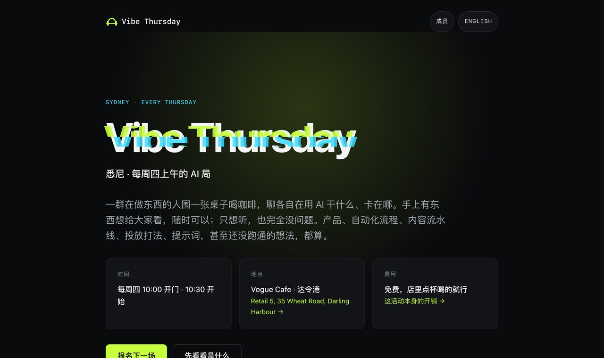

# Vibe Thursday

悉尼每周四上午的 AI 局，和它的网站。

一群在做东西的人围一张桌子喝咖啡，聊各自在用 AI 干什么、卡在哪。不是分享会，
没人讲课。这个仓库是它的站点：[vibethursday.com](https://vibethursday.com)

活动本身免费，不卖票，也没有会员费。

**这个仓库里有两样东西**：网站的代码，和一套[办活动的方法](#顺便一套办活动的方法)——
后者跟这个活动无关也能用。

---

## 这个站在做什么



它不是一个宣传页。四件事都是为了让线下那两个小时更好用：

| | |
| --- | --- |
| **报名** | 一张 30 秒填完的表。人数直接决定跟店里怎么订位子 |
| **成员墙** `/members` | 一人一张卡：在做什么、想找什么、能帮什么。**来之前先知道该找谁聊**，比到现场花半小时试探快得多。报名时勾一下就能上墙 |
| **手机桌牌** `/badge` | 全屏显示名字和一句话，手机往桌上一放当名牌。不用印、不用笔 |
| **开销说明** `/support` | 场地不是免费的。这一页说清楚这件事，给一个自愿分摊的入口，不分摊照样来 |

## 它没有什么

- **没有报名数据。** 数据库不在这个仓库里，`.env` 也从没进过版本控制
- **能不用客户端 JS 的地方都没用。** 相册的堆叠和展开是 `<details>`，没有一行脚本；
  报名表是个 client component（要做 Turnstile 和「这个浏览器来过」的记忆），其余页面
  基本是静态渲染的 HTML
- **没有 webfont。** 全系统字体栈，中文优先，省掉一次字体加载抖动
- **没有第三方统计、没有 cookie 横幅**

## 技术栈

Next.js 16（App Router）· React 19 · Postgres（`pg`，不用 ORM）· Tailwind v4 ·
Cloudflare Turnstile · 部署在 Zeabur。

测试用 Node 内置 runner，零新依赖。

## 本地跑起来

```bash
pnpm install
cp .env.example .env.local   # 按里面的注释填
pnpm dev
```

`.env.example` 里给的 Turnstile 是 Cloudflare 官方的测试密钥对，本地直接能用。
数据库随便一个本地 Postgres 就行，表结构在首次请求时自动建（`src/lib/db.ts`
的 `ensureSchema`）。

```bash
pnpm test    # 单元测试
pnpm lint
pnpm build
```

## 目录

```
src/app/          页面与 API 路由
src/lib/          content.ts（全站中英文案）· db.ts · sessions.ts · members.ts
src/components/   报名表、成员卡、桌牌、认领表单
scripts/          图片管线、图标生成、端到端脚本
skills/event-ops/ 办活动的方法（跟这个站没有依赖关系）
tests/            单元测试
```

**改文案去 `src/lib/content.ts`。** 全站中英两份都在那一个文件里，页面本身不写死
任何一句人话。

**加一场活动的照片**：

```bash
node --experimental-strip-types scripts/build-photos.mts \
  --in "/path/to/照片目录" --session 03
```

它出三档宽度、两种格式，顺手清掉 EXIF（手机照片带 GPS 和机器序列号），
最后打印一段可以贴进 `content.ts` 的代码。

## 几个刻意的决定

- **成员墙按最近出席排序，永远不按点赞。** 卡片是「我是谁、我需要什么」，
  不是排行榜
- **照片里认得出的人脸都遮掉。** 遮不掉又非放不可的，就不放
- **`/badge` 和成员墙都不要求登录去看。** 墙同时是招募页，加一道登录就废了一半
- **报名表是全站最脆的面。** 加字段前先想清楚，它每多一栏就少一批人填完

---

## 顺便：一套办活动的方法

`skills/event-ops/` 是一个 **AI 技能包**，把这个活动从第一场跑到第三场踩出来的
东西整理成了可复用的流程：

```
跑单（开场前） → 复盘（散场后） → 迭代（变成下一场的跑单） → …
                      ↓
              已关闭的决策（不再重开）
```

**它跟这个网站没有任何依赖关系**，读书会、行业午餐、社群例会、工作坊都能用。
它也不是活动策划模板——策划模板告诉你「活动该有哪些环节」，这套东西假设你已经
办过至少一场，要解决的是**为什么那一场没达到预期，下一场改什么**。

里面比较不一样的几条：

- **观察、推断、猜测分开标注**，每个推断后面跟一句「如果我错了，最可能错在哪」
- **找设计矛盾，不是执行失误**。改进措施如果是「下次注意」，说明还停在症状层
- **规模会改变性质**：30 人做宣讲没问题，30 人做轻松聊天就不行
- **「已关闭的决策」表**：同一个提议（要不要收费、要不要换场地）会反复出现，
  每次从头讨论一遍是这类项目最大的时间黑洞

### 怎么装（挑你在用的那一种，只看一段）

**先把 `skills/event-ops` 这个文件夹弄到电脑上。** 不会用 git 的话，
点这个仓库页面右上角绿色的 `Code` → `Download ZIP`，解压之后在里面找到
`skills/event-ops`，放桌面就行。

<details>
<summary><b>Claude Code</b></summary>

把整个 `event-ops` 文件夹复制到 `~/.claude/skills/` 下面：

```bash
mkdir -p ~/.claude/skills
cp -r skills/event-ops ~/.claude/skills/
```

重开一个对话，输入 `/event-ops` 就能用。

</details>

<details>
<summary><b>腾讯 WorkBuddy / Codex / Trae 这类</b></summary>

**什么都不用配置。** 直接在 `event-ops` 这个文件夹里启动它——这些工具会自动
读到文件夹里的 `AGENTS.md`，然后自己去看 `SKILL.md`。

然后直接说人话：「帮我出这周四的跑单」。

</details>

<details>
<summary><b>网页版的 ChatGPT / Claude / 豆包 / Kimi</b></summary>

打开 `event-ops/SKILL.md`，把里面的内容**整段复制**，粘贴到对话框里，
然后另起一行说你要干嘛。

每开一个新对话都要重贴一次——网页版记不住上一次的设定。

</details>

### 怎么用

不用记命令，说这些就行：

- 「帮我出这周四的跑单，上一场的情况我说给你听」
- 「昨天那场复盘一下」——然后把当天发生的事讲一遍，越具体越好
- 「下一场改什么」
- 「有人提议改到周五，要不要采纳」

**记不住的数字就说记不住，不要编。** 它会告诉你下次该记哪几个。

完整说明在 [`skills/event-ops/怎么用.md`](skills/event-ops/怎么用.md)，
写给不懂技术的人看的。

---

## 用它办你自己的局

代码随便拿去用。真要开一个的话，比代码有用的是这几条：

1. **时间雷打不动。** 一旦「这周有没有」需要问一句，它就开始死了
2. **只来两个人也照办**
3. **别让所有人挨个自我介绍。** 三十个人轮一圈半小时就没了，而且没有人记得住
   三十个人。目标不是让所有人互相认识，是让每个人碰上三五个对的人
4. **明说「走开不用打招呼」。** 不说这句，看两眼不感兴趣的人只能干坐着

## In English, briefly

Vibe Thursday is a weekly Thursday-morning meetup in Sydney for people building
things with AI. It runs in Mandarin. This repo is its website — Next.js and
Postgres, no client-side JS where it can be avoided, no analytics, no tracking.

It also ships `skills/event-ops/`, a tool-agnostic AI skill for running recurring
in-person events: run sheets, retros, and turning one into the next. It has no
dependency on this site, and works in Claude Code, Codex-style agents, or by
pasting one file into a chat window.

The code is MIT; the photos in `public/photos/` are not, since they are of real
attendees. The site itself is bilingual: [vibethursday.com](https://vibethursday.com)
and [?lang=en](https://vibethursday.com/?lang=en).

## 协议

**代码是 MIT**，随便拿去用，`skills/event-ops/` 同样。

**`public/photos/` 里的照片不在授权范围内。** 那是真实参与者，虽然认得出的
人脸都遮掉了，但把它们连同代码一起授权出去，等于替这些人做了一个他们没同意
过的决定。要 fork 的话把那个目录换成你自己的照片。

同理，`Vibe Thursday` 这个名字和 logo 也请换掉——不是因为舍不得，是因为
两个同名的局会让想来的人走错地方。

## 关于钱

这个局免费，但场地不是。每周会有最低消费或者场地费，目前先垫着。
想一起分摊的话有个入口，不分摊照样来，也没人会知道谁给了谁没给。

<a href="https://ko-fi.com/vibethursday" target="_blank">
  
</a>
